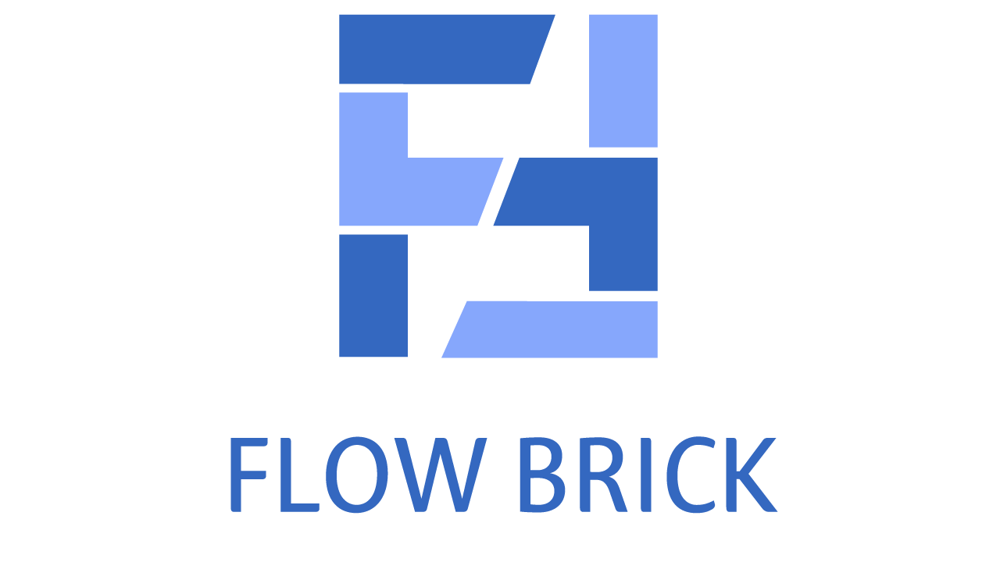

# FlowBrick

   
  
   

목차

## 프로젝트 소개

### PMS(Project Management System)시스템 구현

 
  - 현업에서 많이사용하는 프로그램의 흐름과 개요를 최대한 자세하게 구현함 
  - 프로젝트관리, 캘린더, 일정기능을 비롯하여 공지사항, 채팅기능 부가적인 요소들도 구현

 

## 기술 스택

| JavaScript | JAVA       |  Html    |  CSS   |  Oracle   |  SpringBoot   |
| :--------: | :--------: | :------: | :-----: |:-----: |:-----: |
|   ![js]    |     | ![html] | ![css] |  | ![spring] |

 

## 팀원 및 담 기능

### 이준호
####  -프로젝트 등록, 캘린더, 칸반보드

### 문해인
#### 로그인, 회원관리, 부서관리, 채팅

### 박성중 [@psj1561](https://github.com/psj1561)
#### 대시보드(메인화면), 공지사항, 파일 업로드/다운로드, 프로젝트 결재

### 장선웅
#### 프로젝트 수정/삭제, 자원관리, 간트차트

 

## 배운 점 & 아쉬운 점

 

## 라이센스 및 인용

### -MIT &copy; [NoHack](mailto:lbjp114@gmail.com) 
### -사이트디자인: BootStrap5 https://www.w3schools.com/bootstrap5/index.php

<!-- Stack Icon Refernces -->

[js]: /images/stack/javascript.svg
[ts]: /images/stack/typescript.svg
[react]: /images/stack/react.svg
[node]: /images/stack/node.svg
[css]: /images/stack/css.svg
[html]: /images/stack/html.svg
[java]: /images/stack/java.png 
[oracle]: /images/stack/oracle.png
[spring]: /images/stack/spring-96.svg
